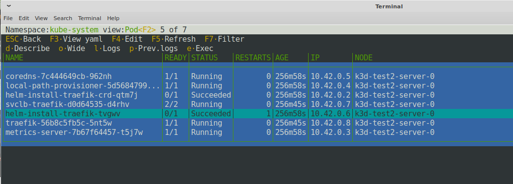

# Description
Ncurses view of a kubernetes cluster (like Midnight Commander)
Allows to navigate through namespaces to view pods, services, deployments etc.


## Installation
### prerequisites
You need to have the following installed to be able to compile this application:
* pkg-config
* libncurses-dev

Also you need [golang compiler](https://go.dev/doc/install)

### build:
Example of build (change output folder how you like):

```
go mod download
go build -o <output-folder>/k8s_ui main.go
```

